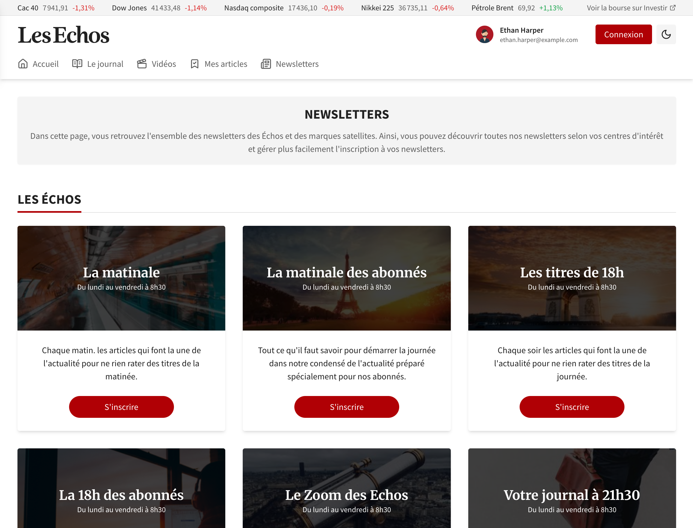

# Technical Test

This project was developed as part of a technical test for _Les Echos_. Its goal is to represent the Newsletters page shown in the Figma design [here](https://www.figma.com/file/u1hoAP9FOa1FHbBgkE346o/Entretient-Dev-2024?type=design&node-id=1-309&mode=design).



It is a **React 19** application built with **Vite 6**, **TypeScript 5**, and **Tailwind CSS 3**. It showcases a responsive design with a dynamic header, navigation, user menu (mobile and desktop variations), and a newsletters section. The project also includes state management for user switching, scrolling effects, and testing with Vitest.

## Table of Contents

- [Features](https://chatgpt.com/c/67d22064-4c70-8002-8a0d-98a14d6d97b3?model=o1#features)
- [Getting Started](https://chatgpt.com/c/67d22064-4c70-8002-8a0d-98a14d6d97b3?model=o1#getting-started)
- [Scripts Overview](https://chatgpt.com/c/67d22064-4c70-8002-8a0d-98a14d6d97b3?model=o1#scripts-overview)
- [Testing](https://chatgpt.com/c/67d22064-4c70-8002-8a0d-98a14d6d97b3?model=o1#testing)
- [Deployment](https://chatgpt.com/c/67d22064-4c70-8002-8a0d-98a14d6d97b3?model=o1#deployment)
- [Folder Structure](https://chatgpt.com/c/67d22064-4c70-8002-8a0d-98a14d6d97b3?model=o1#folder-structure)
- [License](https://chatgpt.com/c/67d22064-4c70-8002-8a0d-98a14d6d97b3?model=o1#license)

## Features

- **Responsive Design:** Different behaviors for mobile and desktop.
- **Dynamic Header:** Changes based on scroll position and user interaction.
- **User Management:** Switch between different user profiles.
- **Newsletters Section:** Displays newsletters and related information.
- **Mobile-First Navigation:** Menu and user options adapt to mobile view.
- **Tailwind CSS:** Utility-first CSS framework for styling.
- **Linting & Formatting:** ESLint configuration for code quality.
- **Testing:** Vitest and React Testing Library for unit tests.

## Getting Started

To get a local copy up and running, follow these steps.

### Prerequisites

- [Node.js](https://nodejs.org/) (v18 or higher)
- [npm](https://www.npmjs.com/) (or yarn)

### Installation

1.  Clone the repository:

```
git clone git@github.com:bnabet/les-echos.git
cd les-echos
```

2.  Install dependencies:

```
npm install
```

## Scripts Overview

Below are some of the key scripts from the `package.json`:

- **`npm run dev`**\
  Starts the development server using Vite.

- **`npm run build`**\
  Compiles TypeScript with `tsc -b`, then builds the production bundle using Vite.\
  Outputs files to the `dist` folder.

- **`npm run test`**\
  Executes unit tests once using Vitest.

- **`npm run test:watch`**\
  Executes unit tests in watch mode, useful during development.

- **`npm run deploy`**\
  Deploys the `dist` folder to GitHub Pages using `gh-pages`.

## Testing

This project uses **Vitest** together with **React Testing Library**.

To run tests once:

```
npm run test
```

To run tests in watch mode:

```
npm run test:watch
```

## Deployment

For deployment, build the project with:

```
npm run build
```

If deploying on GitHub Pages, this script will push the contents of `dist` to the `gh-pages` branch.

```
npm run deploy
```

Ensure you have set the correct `base` property in `vite.config.ts` if your repository is not at the root of your domain.

## Folder Structure

A brief overview of the project structure:

src/\
├── api\
├── assets\
├── components\
├── hooks\
├── mocks\
├── App.tsx\
├── main.tsx\
└── types
